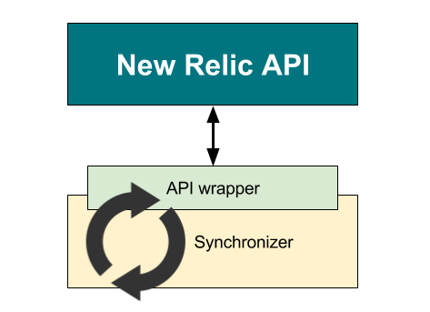

# NewRelic Alerts

Contains:
- New Relic API wrapper
- Alerts Synchronizer
- Deployment marker


## New Relic API wrapper
See [api/README.md](https://gitlab.tech.lastmile.com/internal-open-source/newrelic-alerts/tree/master/api) for more details of New Relic API wrapper.

## Alerts Synchronizer
    
See [newrelic-sync/README.md](https://gitlab.tech.lastmile.com/internal-open-source/newrelic-alerts/tree/master/newrelic-sync) for more details of how to use New Relic alerts synchronizer.

## Mark deployments

See [deployment-marker/README.md](https://gitlab.tech.lastmile.com/internal-open-source/newrelic-alerts/tree/master/deployment-marker) for more details of how to mark deployments.


## Build and publish:

Set environment variables: `MAVEN_REPO_USERNAME`, `MAVEN_REPO_PASSWORD`.

Then execute:

```
./gradlew clean publish -Pbuild_version=<build_version>
```
If build_verison contains "-SNAPSHOT" suffix, it will be published to snapshot repository. Release repository will be used otherwise.
